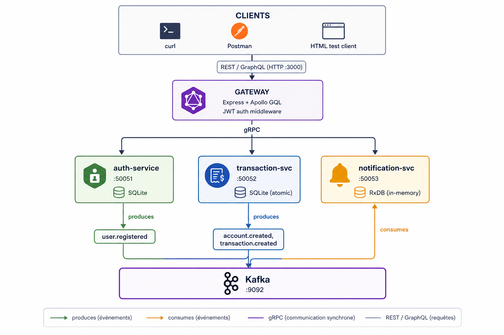
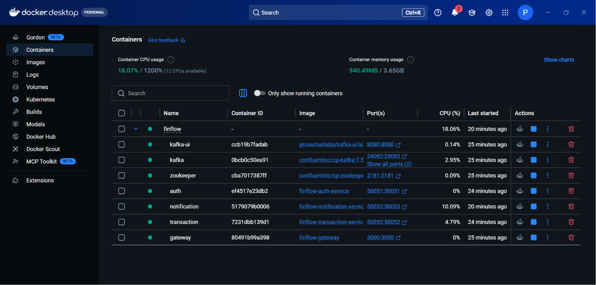
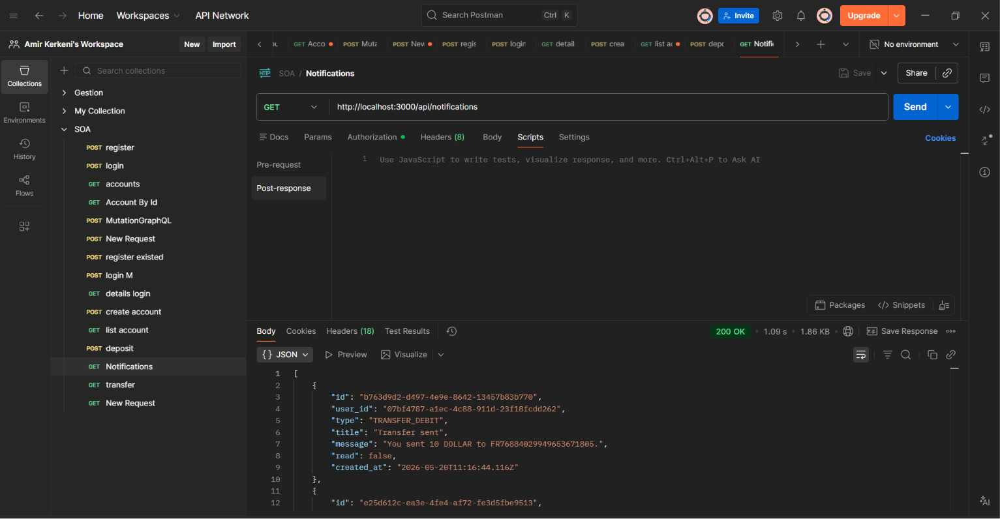

# FinFlow

> A microservices-based digital banking platform — university SOA project.

FinFlow is a polyglot-protocol, event-driven banking backend: **REST + GraphQL** at the edge, **gRPC** between services, and **Kafka** for async events. Three independent microservices (Auth, Transaction, Notification), a single Gateway, and three databases (SQLite × 2 + RxDB) demonstrate per-service persistence and loose coupling.

---

## Architecture



---

## Tech stack

| Layer            | Tech                                                     |
| ---------------- | -------------------------------------------------------- |
| Runtime          | Node.js 20+ (ESM)                                        |
| Gateway          | Express 4, Apollo Server 4, Swagger UI                   |
| Inter-service    | gRPC (`@grpc/grpc-js`, `@grpc/proto-loader`)             |
| Auth             | JWT (jsonwebtoken) + bcryptjs                            |
| Messaging        | Apache Kafka (Confluent images) + KafkaJS                |
| Auth DB          | SQLite (`better-sqlite3`)                                |
| Transaction DB   | SQLite (`better-sqlite3`) with atomic transactions       |
| Notification DB  | **RxDB v15** (NoSQL) — memory storage                    |
| Orchestration    | Docker Compose                                           |
| Observability    | Kafka UI (`localhost:8080`), Swagger (`/api-docs`)       |

---

## Folder structure

```
finflow/
├── docker-compose.yml
├── gateway/                  Express + Apollo + REST/GraphQL/Swagger
│   └── src/
│       ├── rest/             auth, accounts, transactions, notifications
│       ├── graphql/          schema.js, resolvers.js
│       ├── config/           gRPC clients (promisified)
│       └── middleware/       JWT auth, error handler
├── services/
│   ├── auth-service/         JWT issue/verify, users, Kafka producer
│   ├── transaction-service/  Accounts, deposits, withdrawals, transfers
│   └── notification-service/ RxDB + Kafka consumer + gRPC
│       └── src/
│           ├── db/           rxdb.js, notifications.schema.js
│           ├── services/     notification.service.js
│           ├── kafka/        consumer.js (3 topics, idempotency)
│           ├── grpc/         notification.handler.js
│           └── index.js
├── shared/
│   ├── proto/                auth.proto, transaction.proto, notification.proto
│   └── src/                  logger.js
├── client/                   Minimal HTML+JS test client
└── docs/                     POSTMAN_COLLECTION.json
```

---

## Prerequisites

- **Node.js 20+**
- **Docker** + **Docker Compose**
- (Optional) curl, jq, Postman

---

## Install & Run (3 commands)

```bash
npm install
docker compose up -d --build
# wait ~15s for Kafka & services
curl http://localhost:3000/health
```

URLs once up:

| URL                                    | What                  |
| -------------------------------------- | --------------------- |
| http://localhost:3000/api              | REST root             |
| http://localhost:3000/graphql          | GraphQL playground    |
| http://localhost:3000/api-docs         | Swagger UI            |
| http://localhost:8080                  | Kafka UI              |

To run locally without Docker:

```bash
docker compose up -d zookeeper kafka kafka-ui    # infra only
npm run dev                                       # all 4 node services in parallel
```

---

## REST endpoints

> All `/api/accounts`, `/api/transactions`, `/api/notifications` routes require `Authorization: Bearer <token>`.

### Auth

```bash
# Register
curl -X POST http://localhost:3000/api/auth/register \
  -H "Content-Type: application/json" \
  -d '{"email":"alice@example.com","password":"secret123","full_name":"Alice"}'

# Login
curl -X POST http://localhost:3000/api/auth/login \
  -H "Content-Type: application/json" \
  -d '{"email":"alice@example.com","password":"secret123"}'
```

### Accounts

```bash
# Create account (default currency EUR)
curl -X POST http://localhost:3000/api/accounts \
  -H "Authorization: Bearer $TOKEN" \
  -H "Content-Type: application/json" \
  -d '{"currency":"EUR"}'

# List my accounts
curl http://localhost:3000/api/accounts -H "Authorization: Bearer $TOKEN"

# Single account
curl http://localhost:3000/api/accounts/<id> -H "Authorization: Bearer $TOKEN"
```

### Transactions

```bash
curl -X POST http://localhost:3000/api/transactions/deposit  \
  -H "Authorization: Bearer $TOKEN" -H "Content-Type: application/json" \
  -d '{"account_id":"<id>","amount":100,"description":"seed"}'

curl -X POST http://localhost:3000/api/transactions/withdraw \
  -H "Authorization: Bearer $TOKEN" -H "Content-Type: application/json" \
  -d '{"account_id":"<id>","amount":20}'

curl -X POST http://localhost:3000/api/transactions/transfer \
  -H "Authorization: Bearer $TOKEN" -H "Content-Type: application/json" \
  -d '{"from_account_id":"<src>","to_account_id":"<dst>","amount":30}'

curl "http://localhost:3000/api/transactions/account/<accountId>" \
  -H "Authorization: Bearer $TOKEN"
```

### Notifications

```bash
curl http://localhost:3000/api/notifications -H "Authorization: Bearer $TOKEN"
curl -X PATCH http://localhost:3000/api/notifications/<id>/read \
  -H "Authorization: Bearer $TOKEN"
```

---

## GraphQL examples

Endpoint: `POST http://localhost:3000/graphql`

```graphql
mutation { register(email:"a@a.com", password:"secret123", fullName:"Alice") { token user { id email } } }

mutation { login(email:"a@a.com", password:"secret123") { token } }

query   { me { id email fullName } myAccounts { id iban balance currency } }

mutation { createAccount(currency:"EUR") { id iban } }

mutation { deposit(accountId:"<id>", amount: 100) { id type amount } }
mutation { transfer(fromAccountId:"<a>", toAccountId:"<b>", amount: 30) { id status } }

query    { myNotifications { id type title message read createdAt } unreadNotificationCount }
mutation { markNotificationAsRead(id:"<nid>") { id read } }
```

---

## Kafka — event-driven backbone

Kafka decouples the write-side services (auth, transaction) from the read-side service (notification). Producers don't know who consumes; consumers can be added without changing producers.

### Topics

| Topic                  | Producer            | Consumer              | Business meaning                                  | Payload (data fields)                                                   |
| ---------------------- | ------------------- | --------------------- | ------------------------------------------------- | ----------------------------------------------------------------------- |
| `user.registered`      | auth-service        | notification-service  | A new user account was created — welcome them.    | `userId, email, fullName`                                               |
| `account.created`      | transaction-service | notification-service  | A bank account was opened — confirm it.          | `accountId, userId, iban, currency, balance`                            |
| `transaction.created`  | transaction-service | notification-service  | Money moved — notify both sender and receiver.    | `transactionId, type, amount, fromAccountId, toAccountId, fromUserId, toUserId, fromIban, toIban, currency, status, description` |

### Message envelope

All events share the same envelope, which makes the consumer generic:

```json
{
  "eventId": "uuid-v4",
  "eventType": "transaction.created",
  "timestamp": "2026-05-19T10:00:00.000Z",
  "version": "1.0",
  "data": { /* topic-specific fields */ }
}
```

- **Producers** — `KafkaJS` producer in each service, fired *after* the database write commits.
- **Consumer** — single notification-service consumer group subscribed to all three topics ([services/notification-service/src/kafka/consumer.js](services/notification-service/src/kafka/consumer.js)).
- **Idempotency** — every processed `eventId` is stored in the RxDB `processed_events` collection; a redelivery is detected and skipped.
- **Operability** — **Kafka UI** at `http://localhost:8080` lets you browse topics, partitions, and messages live.

---

## gRPC — inter-service backbone

gRPC is the **only** transport between the Gateway and the three microservices. REST and GraphQL stop at the Gateway; everything below is Protobuf over HTTP/2.

### .proto contracts

- [shared/proto/auth.proto](shared/proto/auth.proto) — `AuthService` (Register, Login, VerifyToken, GetUser)
- [shared/proto/transaction.proto](shared/proto/transaction.proto) — `TransactionService` (CreateAccount, GetAccount, GetUserAccounts, Deposit, Withdraw, Transfer, GetHistory)
- [shared/proto/notification.proto](shared/proto/notification.proto) — `NotificationService` (GetUserNotifications, MarkAsRead, GetUnreadCount)

Each `.proto` defines strongly-typed `Request` / `Response` messages with explicit field numbers — the contract is the single source of truth shared by the gateway client stubs and the server implementations.

### Implementation

- **Servers** — each microservice loads its `.proto` via `@grpc/proto-loader` and binds handlers with `@grpc/grpc-js`. Listening on `:50051` (auth), `:50052` (transaction), `:50053` (notification).
- **Clients** — the gateway builds promisified stubs in [gateway/src/config](gateway/src/config) so REST/GraphQL resolvers can `await` gRPC calls naturally.
- **HTTP/2 + Protobuf** — handled natively by `@grpc/grpc-js`; multiplexed streams over a single connection per service.
- **Error mapping** — services return canonical gRPC status codes (`NOT_FOUND`, `INVALID_ARGUMENT`, `UNAUTHENTICATED`, `FAILED_PRECONDITION` for insufficient balance, `ALREADY_EXISTS` for duplicate email). The gateway's [middleware/errorHandler](gateway/src/middleware) translates them into HTTP status codes for REST and GraphQL `extensions.code`.
- **Contract ↔ business logic** — every business action (register, deposit, transfer, mark-as-read) has a matching RPC; nothing leaks around gRPC.

---

## REST — edge API

Mounted under `/api` in the Gateway and split by domain:

| Resource         | Verb + Path                                | Backed by gRPC                          |
| ---------------- | ------------------------------------------ | --------------------------------------- |
| Auth             | `POST /api/auth/register`, `/login`        | `AuthService.Register` / `Login`        |
| Accounts         | `POST/GET /api/accounts`, `GET /:id`       | `TransactionService.CreateAccount` …    |
| Transactions     | `POST /api/transactions/{deposit,withdraw,transfer}`, `GET /account/:id` | `TransactionService.Deposit` …          |
| Notifications    | `GET /api/notifications`, `PATCH /:id/read`| `NotificationService.GetUserNotifications` … |

- JWT middleware guards every non-auth route (see [gateway/src/middleware](gateway/src/middleware)).
- Documented and testable via **Swagger UI** at `http://localhost:3000/api-docs`.
- Ready-to-import **Postman collection** at [docs/POSTMAN_COLLECTION.json](docs/POSTMAN_COLLECTION.json).
- Curl examples in the section above.

---

## GraphQL — flexible client API

Endpoint: `POST /graphql` (Apollo Server 4 embedded in the Gateway).

**Why GraphQL here?** REST gives one fixed shape per endpoint; a banking dashboard typically needs *user + accounts + recent transactions + unread count* in a single round-trip. GraphQL lets clients request exactly that, while reusing the same gRPC stubs the REST layer uses — no duplication of business logic.

- **Schema** — [gateway/src/graphql/schema.js](gateway/src/graphql/schema.js): `User`, `Account`, `Transaction`, `Notification` types; queries `me`, `myAccounts`, `myNotifications`, `unreadNotificationCount`; mutations `register`, `login`, `createAccount`, `deposit`, `withdraw`, `transfer`, `markNotificationAsRead`.
- **Resolvers** — [gateway/src/graphql/resolvers.js](gateway/src/graphql/resolvers.js) delegate to the same gRPC clients used by REST.
- **Auth** — JWT is read from the `Authorization` header in the Apollo `context` function and propagated to resolvers.
- Examples in the GraphQL section above.

---

## Database schemas

### Auth (SQLite — `users`)
`id` PK • `email` UNIQUE • `password_hash` • `full_name` • `created_at`

### Transaction (SQLite — `accounts`, `transactions`)
`accounts(id PK, user_id, iban UNIQUE, currency, balance, created_at)`
`transactions(id PK, from_account_id?, to_account_id?, amount, type, status, description?, created_at)` — atomically updated within a single SQLite transaction.

### Notification (RxDB — `notifications`, `processed_events`)
`notifications { id PK, userId idx, type, title, message, read, createdAt idx }`
`processed_events { eventId PK, processedAt }` — enforces consumer idempotency.

> **Storage note:** the notification service uses `rxdb/plugins/storage-memory` for project simplicity. Swap for `storage-dexie` (browser) or `storage-mongodb` for persistence — only [services/notification-service/src/db/rxdb.js](services/notification-service/src/db/rxdb.js) changes.

---

## Screenshots

### Docker Desktop — all services running



`docker compose up -d --build` brings the entire stack up in one command: Zookeeper, Kafka broker, Kafka UI, and the four Node services (gateway, auth, transaction, notification). The screenshot shows every container healthy and listening on its mapped port.

### Postman — REST endpoints tested



The Postman collection at [docs/POSTMAN_COLLECTION.json](docs/POSTMAN_COLLECTION.json) exercises the full REST surface — register, login, create account, deposit, withdraw, transfer, list notifications. The screenshot shows a successful run end-to-end against the live gateway.

---

## End-to-end demo scenario

1. **Register** Alice via REST → auth-service writes to SQLite → publishes `user.registered` → notification-service stores a welcome notification.
2. **Login** Alice → receives JWT.
3. **Create account** (GraphQL `createAccount`) → transaction-service writes to SQLite → publishes `account.created` → notification appears.
4. **Deposit** 100 EUR (REST) → atomic SQLite tx → `transaction.created` → notification.
5. **Transfer** 30 EUR to Bob → single SQLite transaction debits/credits both sides → notification for both users.
6. **Query** `myNotifications` via GraphQL — single round-trip returns user + accounts + notifications.

The HTML client in [client/](client/) walks through the whole flow without writing any code.

---

## Originality & added value

- **Polyglot persistence in one project** — SQLite (relational, ACID) for money + RxDB (NoSQL, reactive) for notifications. The same data is *not* duplicated; each service owns what fits its access pattern.
- **Atomic transfers** — the transfer RPC executes debit + credit + transaction row inside a single `better-sqlite3` transaction (see [services/transaction-service](services/transaction-service)), so the balance can never drift.
- **Idempotent consumers** — `processed_events` collection guards against Kafka redeliveries, which matters as soon as the consumer restarts.
- **Three protocols, one business core** — REST, GraphQL, and gRPC all share the same underlying domain logic; the project shows when each protocol is the right tool.
- **Containerized** — `docker compose up -d --build` brings up Zookeeper, Kafka, Kafka UI, and all four Node services. No local infrastructure to install.

---

## Known design tradeoff

The `transaction.created` event includes `fromUserId` / `toUserId` resolved at publish time by the transaction-service (it owns the `accounts` table). This keeps the notification-service stateless w.r.t. accounts and avoids an extra gRPC hop. The downside is a slightly fatter event payload — acceptable here.

---

## Team & contributions

| Member              | Day | Scope                                                                | %     |
| ------------------- | --- | -------------------------------------------------------------------- | ----- |
| **Amir Kerkeni**    | 1   | Project foundation, Docker Compose, gateway skeleton, proto contracts | 33%  |
| **Souleima Mahbouba** | 2   | Auth service (JWT + SQLite + bcrypt), Transaction service (atomic SQLite tx, Kafka producers) | 33% |
| **Hiba**            | 3   | Notification service (RxDB + Kafka consumer + gRPC), end-to-end integration, README, Postman, demo, HTML client | 34% |

---

## License

MIT — academic / educational use.
